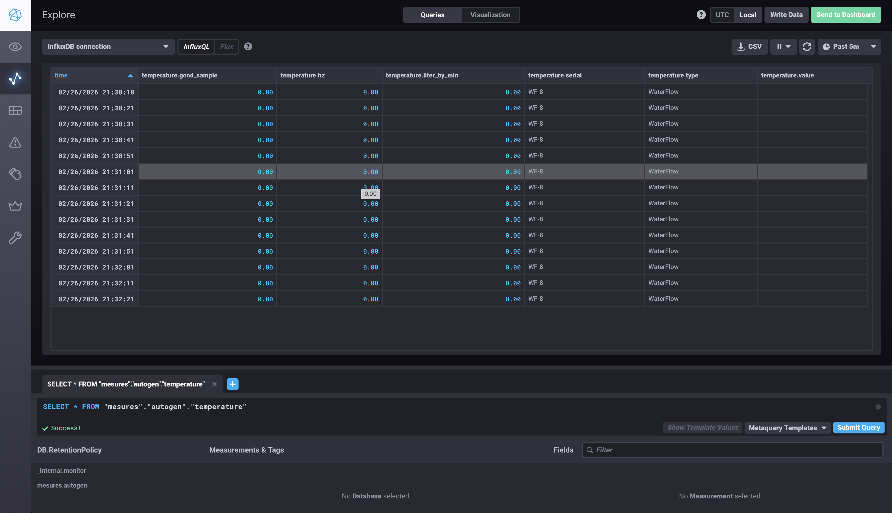
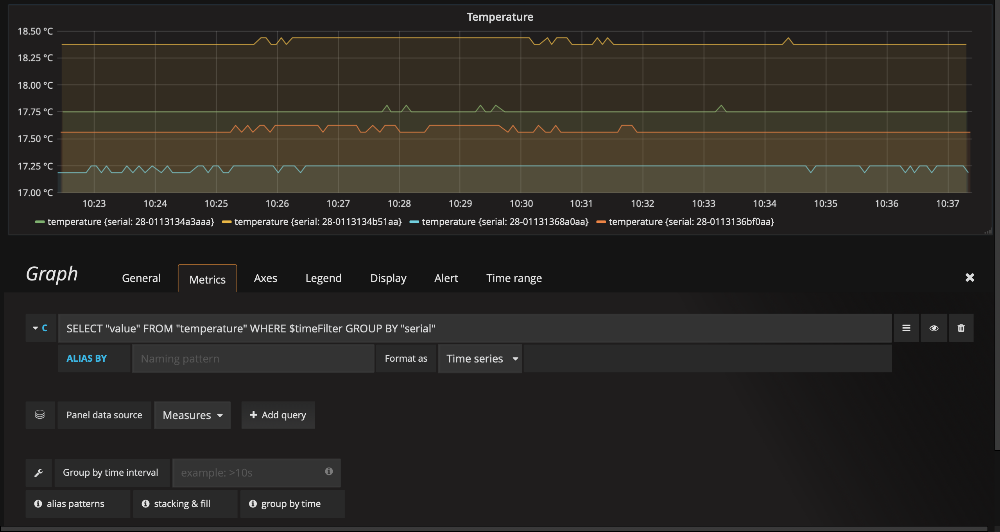

# DS18B20_YF-S201_RaspberryPi

This project demonstrates how to use a Raspberry Pi with a temperature sensor (DS18B20) and water flow meter (YF-S201).

**Version:** 2.1.0 | **Status:** Active  
**Tested on:** Raspberry Pi Zero  
**Python Version:** Python 3.x  
**License:** GPLv3 (modifications must be published publicly)

[Changelog](CHANGELOG.md)

---

## YF-S201 (Water Flow Meter)

### Raspberry Pi Pinout

| Pin | Function      |
|-----|---------------|
| 2   | 5V            |
| 6   | GND           |
| 8   | Data (Meter 1)|
| 10  | Data (Meter 2)|

### Installation & Usage

```bash
cd YF-S201 && python main.py -pin 8
```

---

## DS18B20 (Temperature Sensor)

### Prerequisites

Install Python dependencies:
```bash
sudo python3 -m pip install --break-system-packages influxdb-client requests
```

### Installation

Configure the 1-Wire interface:
```bash
cd DS18B20 && bash install.sh
```

This adds the necessary GPIO configuration to `/boot/config.txt`.

**Required reboot:**
```bash
sudo reboot
```

After reboot, verify the sensor is detected:
```bash
cat /sys/bus/w1/devices/28-XXXXXXXXXXXX/w1_slave
```

### Raspberry Pi Pinout

| Pin | Function |
|-----|----------|
| 1   | 3.3V     |
| 6   | GND      |
| 7   | Data     |

### Running the Sensor

```bash
cd DS18B20 && python3 main.py
```

The sensor will read temperature values and optionally send them to InfluxDB.

---

## InfluxDB

### Overview

InfluxDB 1.8 - Time series database optimized for sensor data and metrics.

**Hardware Requirements:** Compatible with RPi Zero (32-bit)

### Installation

Automated installation script:
```bash
cd InfluxDB && bash install.sh
```

This script:
- Installs InfluxDB 1.8 from the official repository
- Handles GPG keys and APT configuration
- starts the service automatically

**First-time setup:** InfluxDB listens on `http://localhost:8086`

### Web Interfaces

> **Note:** In InfluxDB 1.3 and later (including 1.8), the Web Admin UI on port 8083 is deprecated and disabled by default. InfluxData recommends using Chronograf or the HTTP API instead.

**Chronograf (Recommended GUI):**
```
http://localhost:8888
```
Chronograf is the dedicated user interface for InfluxDB 1.x. It provides:
- Database and retention policy management
- Query builder and explorer
- Data visualization
- User authentication



**HTTP API (Alternative):**
```
http://localhost:8086
```
You can interact directly with InfluxDB using:
- `curl` command
- `influx` CLI
- Grafana (see Grafana section below)

Example API call:
```bash
curl -X POST 'http://localhost:8086/write?db=mydb' \
  --data-binary 'temperature,location=room1 value=22.5'
```

---

## Grafana

### Overview

Grafana - Open-source visualization and dashboarding platform. Works with InfluxDB as data source.

### Installation

Automated installation script:
```bash
cd Grafana && bash install.sh
```

This script:
- Downloads and installs Grafana 9.4.7 (ARM compatible)
- Enables Grafana service for auto-start
- **For RPi Zero:** Creates a 1GB swap file (required for stability)

**First-time access:** Grafana runs on `http://localhost:3000` (default credentials: admin/admin)

### Configuration

1. Add InfluxDB as a data source:
   - Go to **Configuration → Data Sources**
   - URL: `http://localhost:8086`
   - Database: your database name

2. Import or create dashboards to visualize your sensor data

### Example Dashboard

View the included example dashboard configuration:
```bash
cat Grafana/telemetry.json
```

This file contains a pre-configured dashboard layout that you can import into Grafana.



---

## PiOLED (Optional Display)

### Installation

```bash
cd PiOLED && bash install.sh
```

**Note:** Enable the I2C interface when the `raspi-config` dialog appears.

Test with examples from:
```bash
ls Adafruit_Python_SSD1306/examples
```

---

## Start Services at Boot

### Systemd Services

InfluxDB and Grafana are managed by systemd and should automatically start at boot after installation.

Check service status:
```bash
sudo systemctl status influxdb
sudo systemctl status grafana-server
sudo systemctl status chronograf

```

### Python Scripts at Boot

For automatic startup of sensor data collection scripts, edit rc.local:
```bash
sudo nano /etc/rc.local
```

Add these lines **before** the final `exit 0`:
```bash
# Start DS18B20 temperature sensor
python3 /home/pi/DS18B20_YF-S201_RaspberryPi/DS18B20/main.py &

# Start YF-S201 water flow meter
python3 /home/pi/DS18B20_YF-S201_RaspberryPi/YF-S201/main.py -pin 8 &
```

**Note:** Adjust the path `/home/pi/` to match your actual home directory.

For more information on rc.local, see: [Raspberry Pi - rc.local Documentation](https://www.raspberrypi.org/documentation/linux/usage/rc-local.md)

### Monitoring Services

Check logs of running services:
```bash
# InfluxDB logs
sudo journalctl -u influxdb -f

# Grafana logs
sudo journalctl -u grafana-server -f

# Python script logs (if redirected)
tail -f /var/log/syslog | grep python
```

---

## Troubleshooting

### DS18B20 Not Detected

1. Verify the GPIO configuration was applied:
```bash
grep dtoverlay /boot/config.txt
```

2. Check if the 1-Wire module is loaded:
```bash
lsmod | grep w1
```

3. If not loaded, reboot the system:
```bash
sudo reboot
```

### InfluxDB Connection Issues

Check if InfluxDB is running:
```bash
sudo systemctl status influxdb
```

Test HTTP API connectivity:
```bash
curl http://localhost:8086/health
```

### Pi Zero Performance

If experiencing slowness or crashes on Pi Zero:
1. Check available memory:
```bash
free -h
```

2. Increase swap if needed:
```bash
sudo fallocate -l 2G /swapfile
sudo chmod 600 /swapfile
sudo mkswap /swapfile
sudo swapon /swapfile
echo '/swapfile none swap sw 0 0' | sudo tee -a /etc/fstab
```

### Database Management

Create a new InfluxDB database:
```bash
influx
> CREATE DATABASE mydb
```

List all databases:
```bash
influx
> SHOW DATABASES
```

Query data:
```bash
influx
> USE mydb
> SELECT * FROM temperature LIMIT 10
```

---

## Resources

- [OneWire Documentation](https://www.kernel.org/doc/html/latest/w1/index.html)
- [InfluxDB 1.8 Documentation](https://docs.influxdata.com/influxdb/v1.8/)
- [Chronograf Guide](https://docs.influxdata.com/chronograf/latest/)
- [Grafana Documentation](https://grafana.com/docs/)
- [Raspberry Pi Documentation](https://www.raspberrypi.com/documentation/)
